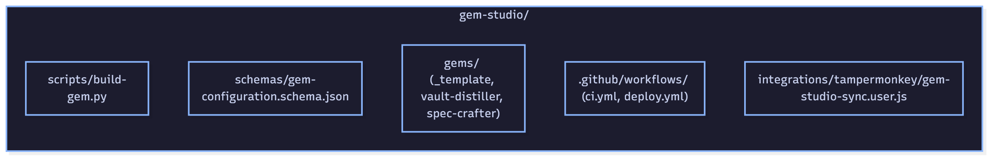
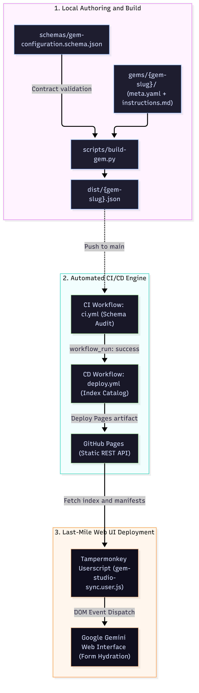
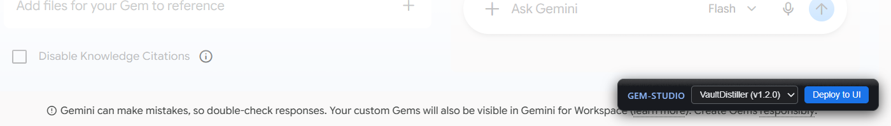

# La ilusión de los "Custom Assistants" ha muerto: por qué necesitas Prompt-as-Code

*Entrega 1 de 9 de la serie [GemStudio: Prompt-as-Code & Declarative AI Systems].*

> **Contexto de la serie:** Esta entrega inaugural plantea el diagnóstico de quiebre del modelo de asistentes comerciales basados en formularios web y establece el marco metodológico de **Prompt-as-Code**, presentando la arquitectura del repositorio `gem-studio` como estándar de desarrollo reproducible.

---

A finales de 2023, la industria tecnológica celebró con entusiasmo casi unánime la inauguración de las tiendas y gestores comerciales de asistentes personalizados: la GPT Store en la plataforma de OpenAI y, meses más tarde, el despliegue de las Gems en el ecosistema de Google Gemini.

La premisa comercial resultaba atractiva para el consumidor masivo: democratizar la personalización de los modelos fundacionales permitiendo que cualquier persona encapsulara instrucciones de sistema en lenguaje natural, adjuntara un puñado de archivos de referencia en formato PDF o texto y activara un par de herramientas auxiliares dentro de un asistente privado, todo mediante formularios gráficos accesibles en el navegador y a golpe de clic.

Hoy, el veredicto técnico es absoluto: **el modelo de "App Store de prompts" y micro-asistentes conversacionales pasivos confinados en jardines vallados tocó techo de forma irreversible.**

La abrumadora mayoría de estos asistentes resultaron ser meros envoltorios superficiales (*wrappers*) erigidos sobre instrucciones elementales que los modelos fundacionales modernos —equipados con ventanas de contexto de millones de tokens y capacidades nativas de razonamiento profundo— resuelven en un único turno conversacional sin necesidad de intermediarios preconfigurados.

Sin embargo, la fractura más grave no residió en la capacidad intrínseca de los modelos, sino en la precariedad de su arquitectura operativa. Gestionar la inteligencia, las restricciones de formato y el comportamiento de un sistema interactivo pegando texto plano en cajas web, lidiando a ciegas con contenedores `contenteditable` y rellenando formularios desarticulados sin linters estáticos, sin esquemas formales de validación, sin entornos de prueba automatizados y sin control de versiones no califica como ingeniería de software: es una acumulación imprudente de deuda técnica.

Si tus directivas operativas, contratos de contexto y reglas de comportamiento solo existen dentro del editor web de Google o de OpenAI, tu trabajo no te pertenece: tu propiedad intelectual es rehén absoluto del arbitrio, los rediseños de interfaz y los cambios de políticas de un proveedor propietario.

---

## El Catalizador: El adiós a las Gems y el auge de las Skills

La confirmación de este cambio de ciclo no tardó en llegar desde las propias compañías que impulsaron estos entornos cerrados. El detonante definitivo que me impulsó a estructurar esta serie de artículos y abrir el código fuente de mi arquitectura fue el anuncio formal de Google sobre **la transición y deprecación progresiva de las Gems en favor de un modelo basado en Skills (Habilidades Agénticas)**.

* **Figura 1 (Anuncio oficial de Google sobre la transición de Gems a Skills):**

Este giro no es un simple cambio de nomenclatura estética de producto: representa el reconocimiento explícito por parte de la industria de que los asistentes conversacionales estáticos son insuficientes. Mientras que una Gem o un GPT tradicional operan como cajas negras aisladas que solo responden cuando se les habla en una pestaña de chat, las **Skills** y los agentes modernos se fundamentan en ejecución de tareas, llamadas a herramientas externas, orquestación en segundo plano y adhesión a protocolos abiertos como el Model Context Protocol (MCP).

Para quienes construyeron sus asistentes directamente sobre el editor web de Google, este anuncio representó el temido fantasma de la migración forzada y la pérdida de control. Para quienes tratamos la inteligencia de los modelos bajo la disciplina de **Prompt-as-Code** y **Docs-as-Code**, el anuncio representó una validación arquitectónica: la lógica, las especificaciones y los contratos de datos viven en un repositorio Git desacoplado y son inmunes a los vaivenes comerciales de las interfaces propietarias.

---

## Anatomía y patologías de los "Jardines Vallados"

El flujo de trabajo promovido por las grandes plataformas SaaS para la configuración de asistentes personalizados adolece de tres fallas de diseño que impiden su adopción en entornos de ingeniería rigurosos:

### 1. La trampa de la interfaz gráfica y la volatilidad del estado en el cliente

Diseñar, depurar y ajustar instrucciones maestras (*system prompts*) dentro de áreas de texto enriquecido web (`contenteditable`, `<rich-textarea>`) introduce una fragilidad inaceptable en el ciclo de vida del artefacto. Las interfaces web comerciales tratan la lógica de comportamiento como si fuera un borrador efímero:

* **Inexistencia de historial y autoría:** En un formulario web no hay control de versiones atómico, careces de herramientas como `git blame` para auditar quién alteró una restricción y no existen registros de diferencias estructurales (`git diff`) entre iteraciones sucesivas.
* **Imposibilidad de ramificación y experimentación:** No se pueden abrir ramas experimentales (*feature branches*) para evaluar variaciones heurísticas de un prompt sin destruir o sobreescribir la versión actualmente en producción.
* **Ausencia de mecanismos de rollback:** Si una modificación sutil en la redacción de las instrucciones genera una regresión en las respuestas del LLM o altera su capacidad de formateo, no existe un mecanismo transaccional para revertir el estado del asistente a un commit específico de forma determinista. Un guardado accidental en el navegador destruye semanas de calibración fina sin dejar registro alguno de auditoría.

### 2. Ausencia de contratos formales, tipado estricto y validación previa al despliegue

Las interfaces gráficas de usuario operan bajo una premisa ciega: aceptan cualquier cadena de caracteres que se introduzca en sus campos, asumiendo pasivamente que el usuario sabe lo que hace. En estos formularios no existen analizadores estáticos ni validadores de esquemas estructurados:

* No hay mecanismos automáticos que impidan desplegar un asistente si se omitió un metadato esencial (como una versión semántica formal, un identificador de autoría estandarizado o las herramientas operativas obligatorias).
* No se verifica si las versiones semánticas cumplen con el estándar formal (`MAJOR.MINOR.PATCH`), lo que degrada la trazabilidad técnica en despliegues concurrentes.
* No se detectan inconsistencias lógicas previas: si el texto exige al asistente ejecutar código pero en la interfaz se deshabilitó el intérprete de ejecución, el formulario no emitirá advertencia alguna. Todo se reduce a una validación ciega en tiempo de ejecución (*runtime*), donde el error de configuración se manifiesta recién cuando el usuario final experimenta una alucinación o un fallo de formato.

### 3. Monolitos farragosos y colapso de la Separación de Responsabilidades (SoC)

La mayoría de las plataformas web condensan en un único cuadro de texto masivo dimensiones operativas que, por arquitectura de software, deberían gestionarse de forma desacoplada:

* La **identidad, autoría y metadatos declarativos:** Parámetros como nombre canónico, descripción técnica, autor responsable y versión operativa.
* Las **directivas procedimentales nucleares:** Algoritmos paso a paso, guardrails de seguridad, directivas de extracción y flujos de ejecución divididos en fases secuenciales estrictas.
* El **catálogo de herramientas y extensiones:** Delimitación explícita de herramientas por defecto (`default_tool`), capacidades de navegación web (`web_search`) o acceso a APIs externas.
* El **tono y estilo operativo:** Las pautas que determinan la cadencia, el nivel de asertividad, la concisión y la identidad comunicativa del modelo al responder.

Al obligar al desarrollador a agrupar todas estas dimensiones en una masa monolítica de texto no estructurado, cualquier ajuste menor de tono exige modificar el mismo cuerpo de texto donde residen las reglas de negocio, multiplicando el riesgo de corromper la lógica funcional del asistente.

---

## La alternativa: Tratando a los Prompts como Código e Infraestructura Declarativa

Para erradicar la fragilidad de los editores visuales, la inteligencia, las directivas procedimentales y las restricciones de un asistente deben ser tratadas con la misma seriedad con la que se gestiona la infraestructura como código (IaC).

Bajo la metodología **Prompt-as-Code** y **Docs-as-Code**:

* **Git como única fuente fáctica de la verdad (*Single Source of Truth*):** Ningún asistente se edita directamente en caliente sobre una interfaz de usuario. Todo cambio funcional o estilístico se origina en un repositorio local, se documenta mediante confirmaciones atómicas siguiendo el estándar de *Conventional Commits* (ej. `feat`, `fix`, `refactor`) y se asocia a versiones semánticas (*SemVer*).
* **Gobernanza declarativa mediante JSON Schema (Draft 2020-12):** La estructura del asistente deja de ser una sugerencia informal y se convierte en un contrato de datos estricto (`schemas/gem-configuration.schema.json`). El esquema impone la presencia obligatoria de metadatos, comportamientos e interfaces de herramientas, bloqueando propiedades arbitrarias mediante directivas `additionalProperties: false` para asegurar la pureza del payload.
* **Separación modular física de responsabilidades:** La arquitectura desacopla el estado estructurado del contenido textual. La configuración, herramientas y dependencias se declaran en formato YAML (`meta.yaml`), mientras que los flujos algorítmicos complejos y las directivas maestras se redactan en Markdown puro (`instructions.md` y `tone-and-style.md`). Esto permite aprovechar herramientas profesionales de desarrollo (resaltado de sintaxis, editores avanzados, linters de Markdown, previsualizadores), evitando la pesadilla técnica de tener que escapar comillas (`\"`), saltos de línea (`\n`) o caracteres especiales dentro de cadenas monolíticas de JSON.
* **Compilación determinista e inmutable:** Un compilador en Python procesa los archivos fuente modulares, valida su contenido de manera estricta contra el JSON Schema, resuelve dependencias textuales y ensambla un archivo JSON final inmutable (`dist/<slug>.json`), listo para ser consumido por APIs directas, orquestadores de agentes o inyectores de interfaz.

---

## Presentando GemStudio: La Arquitectura de Referencia

Para llevar estos principios a la práctica en un entorno de producción real, concebí e implementé **`gem-studio`**, un ecosistema de desarrollo de código abierto que traslada las prácticas de DevOps e ingeniería de software a la gestión integral de asistentes para Gemini.

* **Figura 2 (Topología de repositorio y separación modular de GemStudio):**

### El Flujo Operativo End-to-End: De Git al Runtime del Asistente

El pipeline de entrega continua de GemStudio prescinde completamente de la edición manual en la consola web de Gemini, articulando una cadena de suministro de software automatizada en cuatro etapas:

* **Figura 3 (Pipeline CI/CD y despliegue client-side de GemStudio):**

1. **Definición Modular en Origen:** Cada asistente reside en un subdirectorio aislado dentro de `gems/` (instanciado a partir del boilerplate estandarizado en `_template/` con autoría fijada de forma inmutable a `Ricardo Masabel`). En `meta.yaml` se parametrizan los metadatos declarativos, el versionado semántico, la asignación de herramientas (`tools.default_tool`) y la directiva de comportamiento estilístico (`behavior.tone_and_style`). Paralelamente, en `instructions.md` se escribe el flujo procedimental en Markdown estricto, libre de ataduras de serialización o restricciones visuales.
2. **Compilación Determinista y Concatenación de Comportamiento:** El script local `scripts/build-gem.py` lee las fuentes desacopladas, las valida contra `schemas/gem-configuration.schema.json` mediante la biblioteca `jsonschema` en un entorno virtual aislado (`.venv`) y construye la estructura raíz `gem_configuration`. Para resolver una limitación técnica de la interfaz web de Gemini —que carece de un campo o selector nativo para configurar el tono o estilo de forma independiente—, el compilador realiza una inyección en caliente: concatena de forma determinista un bloque formal `\n\n---\n\n### TONO Y ESTILO OPERATIVO\n...` al pie del texto de instrucciones antes de emitir el manifiesto JSON inmutable en `dist/<slug>.json`.
3. **Fábrica de Cómputo CI/CD Soberana a Coste Cero:** Mediante GitHub Actions, el repositorio ejecuta suites de pruebas continuas en cada push a la rama `main`. Dado que los repositorios privados agotan con rapidez la cuota mensual de minutos en runners alojados por GitHub, la infraestructura se diseñó bajo una arquitectura contenerizada desacoplada: `gem-studio-runner` ejecuta contenedores Docker sobre Ubuntu 24.04 en modo efímero (`--ephemeral`), consumiendo cero minutos facturables de la plataforma mediante scripts de arranque simétricos entre macOS (`launch.sh` vía Docker Desktop) y Windows/WSL2 (`launch.ps1` vía Docker Engine) que solicitan tokens dinámicos de corta duración a la API de GitHub CLI (`gh api`). Tras validar con éxito el esquema, el pipeline empaqueta un catálogo maestro consolidado (`index.json`) y lo despliega automáticamente en GitHub Pages como una API REST estática de alta disponibilidad.
4. **Entrega de Último Tramo (*Last-Mile Delivery* via DOM Manipulation):** Debido a que la API de Google Gemini no ofrece endpoints públicos para la creación y gestión programática de Gems en cuentas personales, la sincronización se realiza mediante ingeniería inversa del cliente web. Un userscript propio desarrollado para Tampermonkey (`gem-studio-sync.user.js`) intercepta la navegación en la Single Page Application (SPA) de Gemini (`/gems/view`, `/gems/edit/<id>`). El script inyecta una barra de herramientas en el DOM, realiza una petición `GM_xmlhttpRequest` al catálogo publicado en GitHub Pages para listar las Gems disponibles y, al accionar el botón de sincronización, localiza de forma precisa los elementos de la interfaz: escribe en el `<input>` de nombre, el `<textarea>` de descripción y, sorteando las trampas de los Web Components de Lit/Angular, detecta el contenedor `div[contenteditable="true"]` del editor de instrucciones. Para forzar la actualización reactiva del estado interno de la plataforma sin que el framework limpie el contenido, el userscript ejecuta `document.execCommand('insertText')` y despacha eventos sintéticos nativos (`InputEvent`), dejando la Gem sincronizada y lista para su uso en un solo clic.

* **Figura 4 (Barra de herramientas flotante de GemStudio inyectada en la UI de Gemini):**

---

## Hoja de Ruta: La Serie Técnica Completa

GemStudio no es únicamente un conjunto de herramientas utilitarias: es una propuesta metodológica integral orientada a devolver el control técnico, la auditabilidad y la reproducibilidad a los ingenieros que construyen sobre modelos de lenguaje.

Para desglosar en profundidad cada una de las capas de diseño de software, infraestructura contenerizada, automatización de frontend y diseño de agentes que componen este sistema, he estructurado esta serie técnica en **9 entregas correlativas**:

* **Entrega 1 (Este artículo):** *El Manifiesto Fundacional — La ilusión de los "Custom Assistants" ha muerto: por qué necesitas Prompt-as-Code*.
* **Entrega 2:** *La Autopsia del Ecosistema — De la GPT Store al olvido: autopsia técnica a los jardines vallados de IA*.
* **Entrega 3:** *El Paradigma SRE — Pensar como SRE en la era de los LLMs: el origen del enfoque GemStudio*.
* **Entrega 4:** *La Especificación Formal y el Compilador — Desacoplando la inteligencia: JSON Schema Draft 2020-12 y compilación determinista*.
* **Entrega 5:** *La Fábrica de Cómputo — CI/CD soberano: Runners efímeros en Docker y despliegue estático a coste cero*.
* **Entrega 6:** *La Última Milla — Bypasseando la SPA: Inyección reactiva y sincronización client-side con Tampermonkey*.
* **Entrega 7:** *Caso de Estudio I: La Topología del Diálogo — VaultDistiller: De sesiones caóticas de terminal a grafos atómicos en Obsidian*.
* **Entrega 8:** *Caso de Estudio II: La Odisea de la Implementación — De NEWTON-SPARK a TITAN-SHIFT: Crónica de un despliegue multiplataforma real*.
* **Entrega 9:** *El Futuro Agéntico — Más allá de las Gems: Prompt-as-Code como cimiento para MCP y agentes autónomos*.

---

El código fuente completo de la plataforma, los esquemas formales en JSON, las definiciones de prompts modulares (`vault-distiller`, `spec-crafter`), los runners contenerizados y el userscript de inyección están disponibles de forma abierta y bajo licencia libre en GitHub:

> Repositorio oficial: **[rmasabela/gem-studio](https://github.com/rmasabela/gem-studio)**

En la siguiente entrega, realizaremos la autopsia técnica a las plataformas web de asistentes personalizados de OpenAI y Google, examinando los límites arquitectónicos que precipitaron su estancamiento y analizando por qué el modelo basado en interfaces gráficas no puede escalar hacia sistemas agénticos de nivel industrial.
